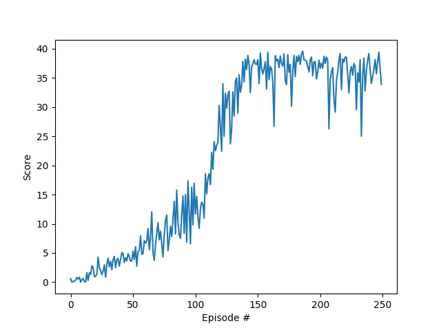

# Report

## Learning Algorithm
The reinforcement learning algorithm implemented in the project is [DDPG](https://arxiv.org/pdf/1509.02971.pdf). 
DDPG is a model-free, off-policy actor-critic algorithm which uses deep function approximators
that can learn policies in high-dimensional, _continuous_ action spaces. This algorithm could be seen as a modification of [Deep Q-Learning](https://arxiv.org/pdf/1509.06461.pdf) algorithm that adapts it to continuous domains.
In this implementation we use two separate networks for the actor and critic.


### Actor-Critic Network Architecture
The input the to the actor network is the state and the output is the action (so actor function µ(s|θ<sup>µ</sup>) specifies the current policy by _deterministically_ mapping states to a specific action). The critic Q(s, a) simply uses the Bellman equation as in Q-learning to learn the value of each state-action pair.


<table>
    <thead>
        <tr>
            <td colspan=4, align="center">Actor</td>
        </tr>
    </thead>
    <thead>
        <tr>
            <th>Layer Name</th>
            <th>Layer Type</th>
            <th>Output Dimension</th>
        </tr>
    </thead>
    <tbody>
        <tr>
            <td >State</td>
            <td >Input</td>
            <td>(33,)</td>
        </tr>
        <tr>
            <td >Hidden 1</td>
            <td >Linear with Relu</td>
            <td>(400,)</td>
        </tr>
        <tr>
            <td >Hidden 2</td>
            <td >Linear with Relu</td>
            <td>(300,)</td>
        </tr>
        <tr>
            <td >Output (µ(s|θ µ)) </td>
            <td >Linear with Tanh</td>
            <td>(4,)</td>
        </tr>
    </tbody>
</table>


<table>
    <thead>
        <tr>
            <td colspan=4, align="center">Critic</td>
        </tr>
    </thead>
    <thead>
        <tr>
            <th>Layer Name</th>
            <th>Layer Type</th>
            <th>Output Dimension</th>
        </tr>
    </thead>
    <tbody>
        <tr>
            <td >State</td>
            <td >Input</td>
            <td>(33,)</td>
        </tr>
        <tr>
            <td >Hidden 1</td>
            <td >Linear with Relu</td>
            <td>(400,)</td>
        </tr>
        <tr>
            <td >Concat</td>
            <td >Concatenation</td>
            <td>(400+action_size,)</td>
        </tr>
        <tr>
            <td >Hidden 2</td>
            <td >Linear with Relu</td>
            <td>(300,)</td>
        </tr>
        <tr>
            <td > Output (Q(s, a)) </td>
            <td >Linear</td>
            <td>(1,)</td>
        </tr>
    </tbody>
</table>

### Important Concepts
*Ornstein Uhlenbeck Noise*: DDPG's success heavily hinges on exploration noises and initial randomness. Without them the agent may repeat the same action, and the critic never observes other states to generalize. In DDPG paper, the authors constructed an exploration policy µ' by adding noise sampled from a noise process N to the actor policy
µ'(s<sub>t</sub>) = µ(s<sub>t</sub>|θ<sup>µ</sup><sub>t</sub>) + N


> N can be chosen to chosen to suit the environment. As detailed in the supplementary materials we
used an Ornstein-Uhlenbeck process (Uhlenbeck & Ornstein, 1930) to generate temporally correlated
exploration for exploration efficiency in physical control problems with inertia.

*Soft updating*: like DQN, DDPG uses a separate target network to decouple the process of choosing the best actions from the estimation of action-values. But in this model the weights of these target networks are updated slowly by tracking the learned networks: θ' ← τθ + (1 −τ )θ' with τ << 1.
### Hyperparameters
```yaml
exp_replay:
    buffer: 100000 # replay buffer size
    batch: 256 # minibatch size
ddpg:
    gamma: 0.99 # discount factor
    tau: 1e-3 # for soft update of target parameters
    lr_acotor: 1e-4 # learning rate
    lr_critic: 1e-4
    weight_decay: 0.0
train:
    n_episodes: 2000
    max_t: 1000
```

## Results

```
Episode 185     Average Score: 27.94
Episode 186     Average Score: 28.17
Episode 187     Average Score: 28.47
Episode 188     Average Score: 28.77
Episode 189     Average Score: 29.07
Episode 190     Average Score: 29.34
Episode 191     Average Score: 29.56
Episode 192     Average Score: 29.83
Episode 193     Average Score: 30.07
Environment solved in 93 episodes!      Average Score: 30.07
```
## Ideas for Improvements

- Using one network for Actor-Critic
- A3C
- D4PG
    
